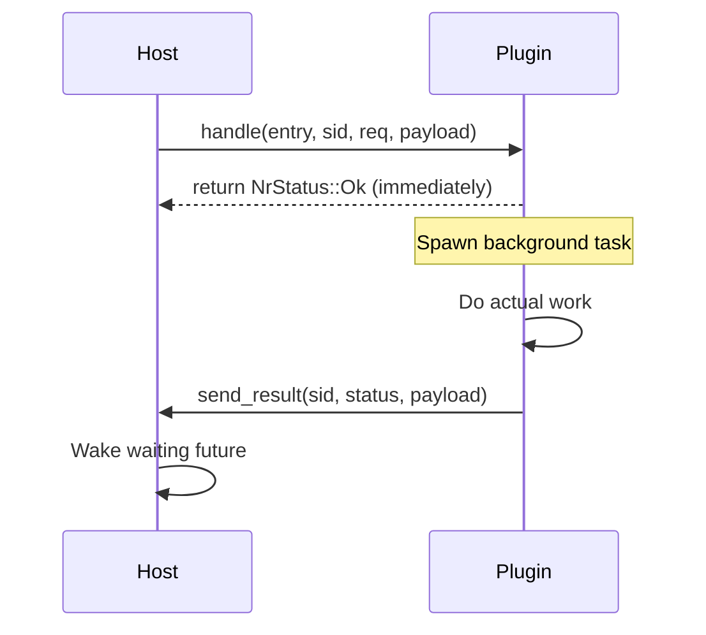
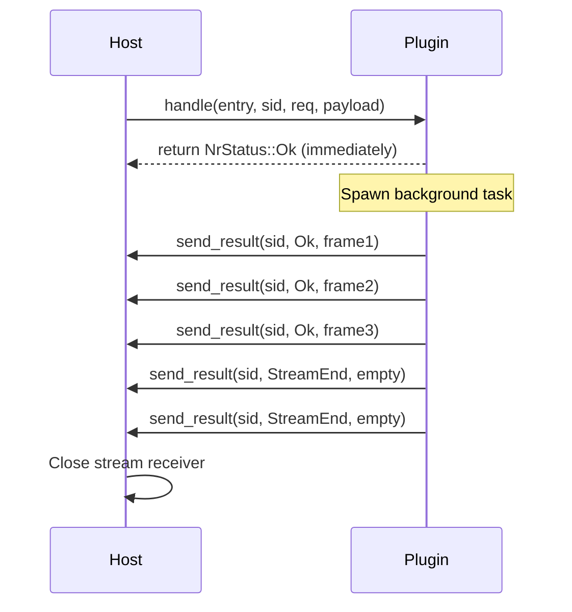
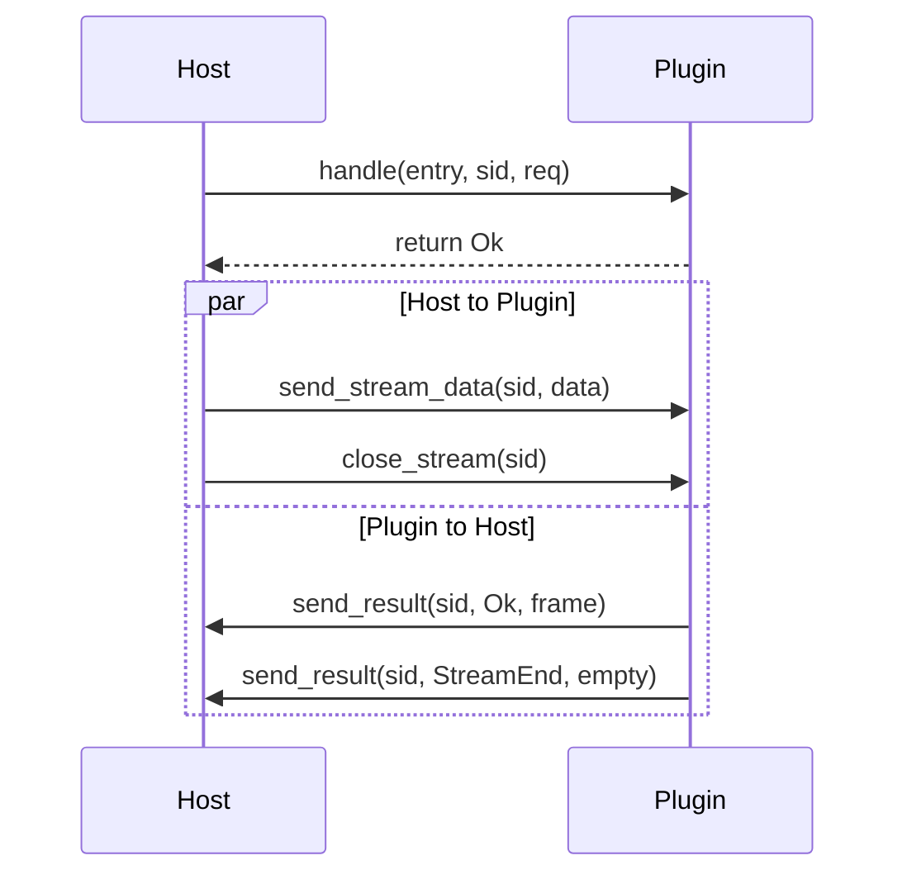

# Nylon Ring: AI Agent Development Guide

> **Purpose**: This document provides AI agents with a comprehensive understanding of the `nylon-ring` ABI-stable plugin system. Use this as your source of truth when working with this codebase.

---

## 🎯 Quick Overview

**nylon-ring** is an **ABI-stable host–plugin interface** that enables:

- ✅ **Cross-language plugins**: Rust, Go, C, C++, Zig
- ✅ **Non-blocking by default**: Async-first design with Tokio
- ✅ **Dual communication modes**: Unary (request/response) + Streaming (WebSocket-style) + Bidirectional
- ✅ **High performance**: ~7M calls/sec (single-core), ~14.65M calls/sec (multi-core), ~4.55M calls/sec (bidirectional)
- ✅ **ABI stability**: All types use C ABI (`#[repr(C)]`)
- ✅ **Production-ready**: Panic-safe FFI, comprehensive error handling

**Target use case**: High-performance proxy systems (Nylon/Pingora) requiring external plugin modules.

---

## 📋 Table of Contents

1. [Architecture Overview](#1-architecture-overview)
2. [ABI Specification](#2-abi-specification)
3. [Host Implementation](#3-host-implementation)
4. [Plugin Implementation](#4-plugin-implementation)
5. [Communication Flow](#5-communication-flow)
6. [State Management](#6-state-management)
7. [Error Handling](#7-error-handling)
8. [Performance](#8-performance)
9. [Multi-Language Support](#9-multi-language-support)
10. [Coding Rules](#10-coding-rules)
11. [Project Structure](#11-project-structure)
12. [Common Tasks](#12-common-tasks)

---

## 1. Architecture Overview

### 1.1 System Components

```
┌─────────────────────────────────────────────────────────┐
│                      Host Application                    │
│                  (Rust + Tokio + DashMap)                │
│                                                           │
│  ┌────────────────┐         ┌──────────────────┐        │
│  │ NylonRingHost  │◄───────►│  Pending Requests│        │
│  │   (Adapter)    │         │    (DashMap)     │        │
│  └────────┬───────┘         └──────────────────┘        │
│           │                                               │
│           │ libloading                                    │
└───────────┼───────────────────────────────────────────────┘
            │
            │ ABI Boundary (C FFI)
            │
┌───────────┼───────────────────────────────────────────────┐
│           │                                               │
│  ┌────────▼───────┐         ┌──────────────────┐        │
│  │ Plugin VTable  │         │  Entry Handlers  │        │
│  │ (init/handle)  │────────►│ (unary/stream)   │        │
│  └────────────────┘         └──────────────────┘        │
│                                                           │
│                Plugin (.so / .dylib / .dll)              │
│              (Rust / Go / C / Zig / etc.)                │
└───────────────────────────────────────────────────────────┘
```

### 1.2 Key Design Principles

| Principle | Description | Why? |
|-----------|-------------|------|
| **ABI Stability** | All types are `#[repr(C)]` | Cross-language compatibility |
| **Non-Blocking** | Plugin `handle()` returns immediately | Don't block host threads |
| **Callback-Based** | Results delivered via `send_result()` | Enable async/background work |
| **Entry Routing** | Multiple handlers per plugin | Flexible plugin design |
| **Zero-Copy** | Borrowed slices (`NrStr`, `NrBytes`) | Minimize overhead |
| **Panic-Safe** | All FFI boundaries catch panics | Production safety |

### 1.3 Communication Modes

#### Unary (Request/Response)



#### Streaming (Multiple Frames)



#### Bidirectional (Full Duplex)



---

## 2. ABI Specification

> **CRITICAL**: These types define the ABI contract. **DO NOT MODIFY** their layout. All changes must be additive (use reserved fields).

### 2.1 Status Codes

```rust
#[repr(u32)]
pub enum NrStatus {
    Ok = 0,          // Success
    Err = 1,         // General error
    Invalid = 2,     // Invalid request/state
    Unsupported = 3, // Unsupported operation
    StreamEnd = 4,   // Stream completed (streaming only)
}
```

**Usage guidelines**:
- `Ok`: Operation successful
- `Err`: Runtime error (network, DB, etc.)
- `Invalid`: Bad input (malformed request, null pointer)
- `Unsupported`: Feature not implemented
- `StreamEnd`: Final frame in streaming mode (signals completion)

### 2.2 Core ABI Types

#### NrStr (UTF-8 String View)

```rust
#[repr(C)]
pub struct NrStr {
    pub ptr: *const u8,  // Pointer to UTF-8 data
    pub len: u32,        // Length in bytes
}
```

**Lifetime**: Borrowed only. Valid during the FFI call.

**Helper functions**:
```rust
impl NrStr {
    pub fn from_str(s: &str) -> Self;  // ~0.51 ns
    pub fn as_str(&self) -> &str;       // ~0.49 ns
}
```

#### NrBytes (Byte Slice View)

```rust
#[repr(C)]
pub struct NrBytes {
    pub ptr: *const u8,  // Pointer to data
    pub len: u64,        // Length in bytes
}
```

**Lifetime**: Borrowed only. Plugin must copy if needed beyond call.

**Helper functions**:
```rust
impl NrBytes {
    pub fn from_slice(data: &[u8]) -> Self;  // ~0.35 ns
    pub fn as_slice(&self) -> &[u8];         // ~0.43 ns
}
```

#### NrHeader (HTTP-style Header)

```rust
#[repr(C)]
pub struct NrHeader {
    pub key: NrStr,
    pub value: NrStr,
}
```

**Helper functions**:
```rust
impl NrHeader {
    pub fn new(key: &str, value: &str) -> Self;  // ~1.09 ns
}
```

#### NrRequest (Request Metadata)

```rust
#[repr(C)]
pub struct NrRequest {
    pub path: NrStr,
    pub method: NrStr,
    pub query: NrStr,
    
    pub headers: *const NrHeader,
    pub headers_len: u32,
    
    // Forward-compatibility
    pub _reserved0: u32,
    pub _reserved1: u64,
}
```

**Design notes**:
- HTTP-centric but generic enough for other protocols
- Reserved fields allow future additions without ABI breaks
- Headers are array (not HashMap) for zero-alloc

**Helper functions**:
```rust
impl NrRequest {
    pub fn build(
        method: &str,
        path: &str,
        query: &str,
        headers: &[NrHeader]
    ) -> Self;  // ~2.48 ns
}
```

### 2.3 Host VTable (Callbacks)

```rust
#[repr(C)]
pub struct NrHostVTable {
    pub send_result: unsafe extern "C" fn(
        host_ctx: *mut c_void,
        sid: u64,              // Stream ID (request ID)
        status: NrStatus,      // Status code
        payload: NrBytes,      // Response data
    ),
}
```

**Contract**:
- ✅ Thread-safe: Can be called from any thread
- ✅ Multiple calls: For streaming, call multiple times per `sid`
- ✅ Final call: Use `NrStatus::StreamEnd` to close stream
- ❌ After close: Don't call `send_result` after `StreamEnd`/`Err`

### 2.4 Plugin VTable (Exports)

```rust
#[repr(C)]
pub struct NrPluginVTable {
    pub init: Option<
        unsafe extern "C" fn(
            plugin_ctx: *mut c_void,
            host_ctx: *mut c_void,
            host_vtable: *const NrHostVTable
        ) -> NrStatus
    >,
    
    pub handle: Option<
        unsafe extern "C" fn(
            plugin_ctx: *mut c_void,
            entry: NrStr,          // Entry name for routing
            sid: u64,              // Stream ID
            req: *const NrRequest, // Request metadata
            payload: NrBytes       // Request body
        ) -> NrStatus
    >,
    
    pub shutdown: Option<
        unsafe extern "C" fn(plugin_ctx: *mut c_void)
    >,

    pub stream_data: Option<
        unsafe extern "C" fn(
            plugin_ctx: *mut c_void,
            sid: u64,
            data: NrBytes
        ) -> NrStatus
    >,

    pub stream_close: Option<
        unsafe extern "C" fn(
            plugin_ctx: *mut c_void,
            sid: u64
        ) -> NrStatus
    >,
}
```

**Function responsibilities**:

| Function | Purpose | Must Return | Runtime |
|----------|---------|-------------|---------|
| `init` | Initialize plugin, store host callbacks | `Ok` or `Err` | Can be slow |
| `handle` | Process request (spawn background task) | **Immediately** | **<1µs** |
| `shutdown` | Cleanup plugin resources | N/A | Can be slow |

### 2.5 Plugin Info (Metadata)

```rust
#[repr(C)]
pub struct NrPluginInfo {
    pub abi_version: u32,           // ABI version (currently 1)
    pub struct_size: u32,           // sizeof(NrPluginInfo)
    
    pub name: NrStr,                // Plugin name
    pub version: NrStr,             // Plugin version
    
    pub plugin_ctx: *mut c_void,    // Plugin-owned context
    pub vtable: *const NrPluginVTable,
}
```

**Entry point**:
```rust
#[no_mangle]
pub extern "C" fn nylon_ring_get_plugin_v1() -> *const NrPluginInfo;
```

**ABI versioning**:
- Current version: `NR_ABI_VERSION = 1`
- Host validates: `plugin_info.abi_version == expected`
- Mismatch = load error

---

## 3. Host Implementation

### 3.1 Host Responsibilities

The host (`nylon-ring-host`) must:

1. **Load plugins** via `libloading`
2. **Validate ABI version** on load
3. **Manage `sid` lifecycle** (generate, track, cleanup)
4. **Provide `send_result` callback** to wake waiting futures
5. **Support both unary and streaming** modes
6. **Maintain per-request state** (optional, via `NrHostExt`)
7. **Handle panics safely** in callbacks

### 3.2 Core Host Types

#### NylonRingHost (Main Interface)

```rust
pub struct NylonRingHost {
    library: Library,                    // libloading handle
    plugin_info: &'static NrPluginInfo,
    context: Arc<HostContext>,
}
```

**API**:
```rust
impl NylonRingHost {
    // Load plugin from .so/.dylib/.dll
    pub fn load(path: impl AsRef<Path>) -> Result<Self, NylonRingHostError>;
    
    // Unary call: single response
    pub async fn call(
        &self,
        entry: &str,
        req: HighLevelRequest
    ) -> Result<(NrStatus, Vec<u8>), NylonRingHostError>;
    
    // Streaming call: multiple frames
    pub async fn call_stream(
        &self,
        entry: &str,
        req: HighLevelRequest
    ) -> Result<StreamReceiver, NylonRingHostError>;
    
    // Raw call: bypass NrRequest (fastest)
    pub async fn call_raw(
        &self,
        entry: &str,
        payload: &[u8]
    ) -> Result<(NrStatus, Vec<u8>), NylonRingHostError>;
    pub async fn call_raw(
        &self,
        entry: &str,
        payload: &[u8]
    ) -> Result<(NrStatus, Vec<u8>), NylonRingHostError>;

    // Send data to active stream
    pub fn send_stream_data(&self, sid: u64, data: &[u8]) -> Result<NrStatus, NylonRingHostError>;

    // Close active stream
    pub fn close_stream(&self, sid: u64) -> Result<NrStatus, NylonRingHostError>;
}
```

#### HostContext (Internal State)

```rust
struct HostContext {
    pending_requests: DashMap<u64, Pending>,      // unary requests
    stream_senders: DashMap<u64, UnboundedSender>, // streaming
    state_per_sid: DashMap<u64, HashMap<String, Vec<u8>>>, // state
    sid_counter: AtomicU64,                        // ID generator
    host_ext: NrHostExt,                           // extension API
}
```

**Why `DashMap`?**
- Fine-grained locking (better than `Mutex<HashMap>`)
- Lock-free reads
- No poison errors
- Excellent multi-core performance

#### HighLevelRequest (User-Facing API)

```rust
pub struct HighLevelRequest {
    pub method: String,
    pub path: String,
    pub query: String,
    pub headers: Vec<(String, String)>,
    pub body: Vec<u8>,
    pub extensions: Extensions,  // Type-safe metadata
}
```

**Extensions**: Type-safe metadata storage (not sent to plugin)
```rust
let mut req = HighLevelRequest { /* ... */ };
req.extensions.insert(UserId(123));
req.extensions.insert("routing_key".to_string());

// Later:
if let Some(user_id) = req.extensions.get::<UserId>() {
    println!("User: {}", user_id.0);
}
```

### 3.3 SID (Stream ID) Management

**Generation**:
```rust
let sid = context.sid_counter.fetch_add(1, Ordering::Relaxed);
```

**Unary lifecycle**:
1. Generate `sid`
2. Create `oneshot` channel
3. Insert into `pending_requests`
4. Call plugin `handle()`
5. Wait on `oneshot.recv()`
6. Remove from `pending_requests`

**Streaming lifecycle**:
1. Generate `sid`
2. Create `mpsc::unbounded_channel()`
3. Insert into `stream_senders`
4. Call plugin `handle()`
5. Return receiver to caller
6. Remove on `StreamEnd` or error

### 3.4 Callback Implementation

The `send_result` callback:

```rust
unsafe extern "C" fn send_result_callback(
    host_ctx: *mut c_void,
    sid: u64,
    status: NrStatus,
    payload: NrBytes,
) {
    std::panic::catch_unwind(|| {
        let ctx = &*(host_ctx as *const HostContext);
        let data = payload.as_slice().to_vec();
        
        // Try unary first
        if let Some((_, sender)) = ctx.pending_requests.remove(&sid) {
            let _ = sender.send((status, data));
            return;
        }
        
        // Try streaming
        if let Some(tx) = ctx.stream_senders.get(&sid) {
            let _ = tx.send(StreamFrame { status, data });
            
            // Clean up on end
            if matches!(status, NrStatus::StreamEnd | NrStatus::Err | ...) {
                ctx.stream_senders.remove(&sid);
                ctx.state_per_sid.remove(&sid);
            }
        }
    }).ok();  // Suppress panics
}
```

---

## 4. Plugin Implementation

### 4.1 Plugin Responsibilities

Plugins must:

1. **Export `nylon_ring_get_plugin_v1()`** entry point
2. **Implement `init()`** to store host callbacks
3. **Implement `handle()`** that returns **immediately**
4. **Spawn background tasks** for actual work
5. **Call `send_result()`** when work completes
6. **Copy all data** from borrowed ABI types
7. **Handle panics safely** (caught by `define_plugin!` macro)

### 4.2 Using `define_plugin!` Macro (Rust)

The easiest way to create plugins:

```rust
use nylon_ring::{define_plugin, NrBytes, NrHostVTable, NrRequest, NrStatus, NrStr};
use std::ffi::c_void;
use std::sync::OnceLock;
use std::thread;

struct HostHandle {
    ctx: *mut c_void,
    vtable: *const NrHostVTable,
}

unsafe impl Send for HostHandle {}
unsafe impl Sync for HostHandle {}

static HOST_HANDLE: OnceLock<HostHandle> = OnceLock::new();

unsafe fn plugin_init(
    _plugin_ctx: *mut c_void,
    host_ctx: *mut c_void,
    host_vtable: *const NrHostVTable,
) -> NrStatus {
    HOST_HANDLE.set(HostHandle { ctx: host_ctx, vtable: host_vtable })
        .map_or(NrStatus::Err, |_| NrStatus::Ok)
}

unsafe fn handle_unary(
    _plugin_ctx: *mut c_void,
    sid: u64,
    req: *const NrRequest,
    payload: NrBytes,
) -> NrStatus {
    // CRITICAL: Copy all data before spawning
    let payload_copy = payload.as_slice().to_vec();
    
    if let Some(host) = HOST_HANDLE.get() {
        let host_ctx = host.ctx;
        let send_result = (*host.vtable).send_result;
        
        // Spawn background task
        thread::spawn(move || {
            // Do actual work here (can block)
            let response = b"Hello from plugin!";
            
            // Send result back
            send_result(
                host_ctx,
                sid,
                NrStatus::Ok,
                NrBytes::from_slice(response),
            );
        });
    }
    
    NrStatus::Ok  // Return immediately
}

unsafe fn plugin_shutdown(_plugin_ctx: *mut c_void) {
    // Cleanup
}

define_plugin! {
    init: plugin_init,
    shutdown: plugin_shutdown,
    entries: {
        "unary" => handle_unary,
    },
    stream_handlers: {
        data: handle_stream_data,
        close: handle_stream_close,
    },
}
```

**What `define_plugin!` does**:
- ✅ Creates `NrPluginVTable` with panic-safe wrappers
- ✅ Exports `nylon_ring_get_plugin_v1()` symbol
- ✅ Routes requests by entry name
- ✅ Catches all panics and returns `NrStatus::Err`

### 4.3 Entry-Based Routing

Plugins can support multiple handlers:

```rust
define_plugin! {
    init: plugin_init,
    shutdown: plugin_shutdown,
    entries: {
        "unary" => handle_unary,      // /unary endpoint
        "stream" => handle_stream,    // /stream endpoint
        "echo" => handle_echo,        // /echo endpoint
    },
    raw_entries: {
        "fast_echo" => handle_raw_echo,  // Bypass NrRequest parsing
    },
}
```

Host calls:
```rust
host.call("unary", req).await?;   // → handle_unary
host.call("stream", req).await?;  // → handle_stream
host.call_raw("fast_echo", b"data").await?;  // → handle_raw_echo
```

### 4.4 Streaming Implementation

```rust
unsafe fn handle_stream(
    _plugin_ctx: *mut c_void,
    sid: u64,
    _req: *const NrRequest,
    _payload: NrBytes,
) -> NrStatus {
    if let Some(host) = HOST_HANDLE.get() {
        let host_ctx = host.ctx;
        let send_result = (*host.vtable).send_result;
        
        thread::spawn(move || {
            // Send multiple frames
            for i in 1..=5 {
                let frame = format!("Frame {}", i);
                send_result(
                    host_ctx,
                    sid,
                    NrStatus::Ok,
                    NrBytes::from_slice(frame.as_bytes()),
                );
                thread::sleep(Duration::from_secs(1));
            }
            
            // Signal end of stream
            send_result(
                host_ctx,
                sid,
                NrStatus::StreamEnd,
                NrBytes::from_slice(&[]),
            );
        });
    }
    
    NrStatus::Ok
}
```

**Streaming rules**:
- Send multiple frames with `NrStatus::Ok`
- Final frame must be `NrStatus::StreamEnd`
- Final frame must be `NrStatus::StreamEnd`
- Host closes stream on `StreamEnd`/`Err`/`Invalid`/`Unsupported`

### 4.5 Bidirectional Handlers

```rust
unsafe fn handle_stream_data(
    _plugin_ctx: *mut c_void,
    sid: u64,
    data: NrBytes,
) -> NrStatus {
    // Handle data from host
    NrStatus::Ok
}

unsafe fn handle_stream_close(
    _plugin_ctx: *mut c_void,
    sid: u64,
) -> NrStatus {
    // Handle close signal
    NrStatus::Ok
}
```

---

## 5. Communication Flow

### 5.1 Unary Call Flow (Detailed)

```
┌──────────┐                                    ┌────────────┐
│   Host   │                                    │   Plugin   │
└────┬─────┘                                    └─────┬──────┘
     │                                                │
     │ 1. Build HighLevelRequest                     │
     │ 2. Convert to NrRequest + NrBytes              │
     │ 3. sid = generate_id()                         │
     │ 4. Create oneshot channel                      │
     │ 5. Insert into pending_requests                │
     │                                                │
     │ 6. vtable.handle(entry, sid, req, payload)     │
     │───────────────────────────────────────────────>│
     │                                                │
     │                                                │ 7. Copy all data
     │                                                │ 8. Return NrStatus::Ok
     │<───────────────────────────────────────────────│
     │                                                │
     │ 9. await oneshot.recv()                        │
     │                                                │
     │                                                │ 10. Spawn thread
     │                                                │ 11. Do actual work
     │                                                │ 12. Build response
     │                                                │
     │ 13. send_result(sid, status, payload)          │
     │<───────────────────────────────────────────────│
     │                                                │
     │ 14. Wake oneshot sender                        │
     │ 15. Remove from pending_requests               │
     │ 16. Return (status, payload) to caller         │
     │                                                │
```

### 5.2 Streaming Call Flow (Detailed)

```
┌──────────┐                                    ┌────────────┐
│   Host   │                                    │   Plugin   │
└────┬─────┘                                    └─────┬──────┘
     │                                                │
     │ 1-5. Same as unary                             │
     │ 6. Create mpsc::unbounded_channel              │
     │ 7. Insert into stream_senders                  │
     │                                                │
     │ 8. vtable.handle(entry, sid, req, payload)     │
     │───────────────────────────────────────────────>│
     │                                                │
     │                                                │ 9. Copy all data
     │<───────────────────────────────────────────────│ 10. Return Ok
     │                                                │
     │ 11. Return StreamReceiver to caller            │
     │                                                │
     │                                                │ 12. Spawn thread
     │                                                │ 13. Loop start
     │                                                │
     │ 14. send_result(sid, Ok, frame1)               │
     │<───────────────────────────────────────────────│
     │ 15. Push to mpsc channel                       │
     │                                                │
     │                                                │ 16. Continue work
     │                                                │
     │ 17. send_result(sid, Ok, frame2)               │
     │<───────────────────────────────────────────────│
     │                                                │
     │                                                │ 18. Work complete
     │                                                │
     │ 19. send_result(sid, StreamEnd, empty)         │
     │<───────────────────────────────────────────────│
     │                                                │
     │ 20. Remove from stream_senders                 │
     │ 21. Close mpsc channel                         │
     │ 22. Caller receives None from recv()           │
     │                                                │
```

---

## 6. State Management

### 6.1 Per-SID State

Host provides state storage per request/stream:

```rust
// In HostContext
state_per_sid: DashMap<u64, HashMap<String, Vec<u8>>>
```

**Lifecycle**:
- Created on first `set_state()` call
- Persists for entire request/stream
- Automatically cleaned up on completion

### 6.2 Host Extension API

```rust
#[repr(C)]
pub struct NrHostExt {
    pub set_state: unsafe extern "C" fn(
        host_ctx: *mut c_void,
        sid: u64,
        key: NrStr,
        value: NrBytes
    ) -> NrBytes,
    
    pub get_state: unsafe extern "C" fn(
        host_ctx: *mut c_void,
        sid: u64,
        key: NrStr
    ) -> NrBytes,
}
```

### 6.3 Accessing State from Plugin

```rust
// In plugin_init(), get host extension
let host_ext = nylon_ring_host::NylonRingHost::get_host_ext(host_ctx);

// Store in plugin handle
struct HostHandle {
    ctx: *mut c_void,
    vtable: *const NrHostVTable,
    ext: *const NrHostExt,
}

static HOST_HANDLE: OnceLock<HostHandle> = OnceLock::new();

// In handlers, use state
if let Some(host) = HOST_HANDLE.get() {
    if !host.ext.is_null() {
        // Set state
        let set_state = (*host.ext).set_state;
        set_state(
            host.ctx,
            sid,
            NrStr::from_str("session_id"),
            NrBytes::from_slice(b"abc123"),
        );
        
        // Get state
        let get_state = (*host.ext).get_state;
        let value = get_state(host.ctx, sid, NrStr::from_str("session_id"));
        let session_id = value.as_slice();
    }
}
```

**Use cases**:
- WebSocket session management
- Multi-frame state in streaming
- Plugin-local agent state
- Per-request metadata

---

## 7. Error Handling

### 7.1 Error Types

Host uses `thiserror` for error handling:

```rust
use thiserror::Error;

#[derive(Debug, Error)]
pub enum NylonRingHostError {
    #[error("failed to load plugin library: {0}")]
    LoadError(#[source] libloading::Error),
    
    #[error("ABI version mismatch: expected {expected}, got {actual}")]
    AbiVersionMismatch { expected: u32, actual: u32 },
    
    #[error("plugin initialization failed")]
    InitFailed,
    
    #[error("invalid plugin entry point")]
    InvalidEntryPoint,
    
    #[error("request timeout")]
    Timeout,
    
    #[error("stream closed")]
    StreamClosed,
}
```

### 7.2 Error Handling Rules

**For AI agents working on this codebase**:

1. ❌ **NEVER use `unwrap()` or `expect()`** in production code
   - Only allowed in tests and benchmarks
   - Use `?` operator or explicit pattern matching

2. ❌ **NEVER use `anyhow`** crate
   - Use custom error enums with `thiserror`
   - Provides better error clarity

3. ✅ **All fallible functions return `Result`**
   ```rust
   pub fn load(path: &Path) -> Result<Self, NylonRingHostError> { /* ... */ }
   ```

4. ✅ **All `extern "C"` functions are panic-safe**
   ```rust
   unsafe extern "C" fn callback() {
       std::panic::catch_unwind(|| {
           // Your code here
       }).ok();  // Suppress panics
   }
   ```

5. ✅ **Use descriptive error messages**
   ```rust
   #[error("failed to load plugin from {path}: {source}")]
   LoadError { path: String, source: libloading::Error }
   ```

### 7.3 Status Code Usage

| Status | When to Use | Example |
|--------|-------------|---------|
| `Ok` | Operation successful | Normal response |
| `Err` | Runtime error | DB connection failed |
| `Invalid` | Bad input | Null pointer, malformed request |
| `Unsupported` | Feature not implemented | Unknown entry point |
| `StreamEnd` | Stream completion | Final frame sent |

---

## 8. Performance

### 8.1 Benchmark Results

> **Hardware**: Apple M1 Pro (10-core), release builds

#### ABI Layer Performance

| Operation | Time | Throughput | Impact |
|-----------|------|------------|--------|
| `NrStr::from_str` | ~0.51 ns | N/A | Negligible |
| `NrStr::as_str` | ~0.49 ns | N/A | Negligible |
| `NrBytes::from_slice` | ~0.35 ns | N/A | Negligible |
| `NrBytes::as_slice` | ~0.43 ns | N/A | Negligible |
| `NrHeader::new` | ~1.09 ns | N/A | Negligible |
| `NrRequest::build` | ~2.48 ns | N/A | Negligible |

**Conclusion**: ABI overhead is **0.35–2.5 ns** — essentially free.

#### Host Overhead Performance

| Benchmark | Latency | Throughput (single-core) | Notes |
|-----------|---------|--------------------------|-------|
| Standard unary | ~0.43 µs | ~2.32M req/sec | Default path |
| Bidirectional | N/A | **~4.55M calls/sec** | 5 frames + 1 echo |
| Unary + 1KB body | ~0.49 µs | ~2.05M req/sec | Body size minimal impact |
| Raw unary | ~0.16 µs | ~6.31M req/sec | Skip NrRequest parsing |
| Fast raw unary | ~0.14 µs | ~7.14M req/sec | Thread-local optimization |
| Streaming (5 frames) | ~0.83 µs | ~1.20M req/sec | All frames consumed |
| Build HighLevelRequest | ~216 ns | N/A | Construction overhead |

**Overhead sources**:
1. FFI boundary crossing
2. Tokio async scheduling
3. DashMap concurrent operations
4. Plugin's own work

#### Multi-Core Scaling

| Path | Throughput (10 cores) | Speedup vs Single-Core | Notes |
|------|----------------------|------------------------|-------|
| Standard (`call_raw`) | **~11.16M req/sec** | ~1.77x | Good scaling |
| Fast path (`call_raw_unary_fast`) | **~14.65M req/sec** | ~2.05x | Excellent scaling |
| Bidirectional | **~4.55M req/sec** | N/A | 5 frames + 1 echo |

**Key insight**: Nearly **2x** scaling efficiency indicates minimal contention with `DashMap`.

### 8.2 Optimization Guidelines

**For AI agents optimizing this codebase**:

1. **Don't optimize ABI layer** — already at memory bandwidth limit
2. **Use `DashMap` over `Mutex<HashMap>`** — better for concurrent workloads
3. **Minimize allocations in hot path** — reuse buffers when possible
4. **Keep `handle()` fast** — <1µs, spawn background tasks
5. **Use thread pools** — avoid spawning threads per request
6. **Profile before optimizing** — measure, don't guess

---

## 9. Multi-Language Support

### 9.1 Language Support Matrix

| Language | Difficulty | Method | Example Location |
|----------|-----------|--------|------------------|
| **Rust** | ⭐ Easy | `define_plugin!` macro | `nylon-ring-plugin-example/` |
| **Go** | ⭐⭐ Moderate | High-level SDK | `nylon-ring-go/plugin-example-simple/` |
| **Go (CGO)** | ⭐⭐⭐ Hard | Low-level CGO | `nylon-ring-go/plugin-example/` |
| **C** | ⭐⭐⭐ Hard | Direct C ABI | Not implemented yet |
| **C++** | ⭐⭐⭐ Hard | extern "C" | Not implemented yet |
| **Zig** | ⭐⭐ Moderate | C ABI export | Not implemented yet |

### 9.2 Go Plugin (SDK)

Easiest Go implementation:

```go
package main

import (
    "github.com/AssetsArt/nylon-ring/nylon-ring-go/sdk"
)

func init() {
    plugin := sdk.NewPlugin("my-plugin", "1.0.0")
    
    // Non-blocking handler (runs in goroutine)
    plugin.Handle("unary", func(req sdk.Request, payload []byte, callback func(sdk.Response)) {
        // Can do blocking work (DB, network, etc.)
        callback(sdk.Response{
            Status: sdk.StatusOk,
            Data:   []byte("Hello from Go!"),
        })
    })
    
    // Blocking handler (runs on host thread - fast path only)
    plugin.HandleSync("fast", func(req sdk.Request, payload []byte, callback func(sdk.Response)) {
        // Must be very fast (<1µs)
        callback(sdk.Response{Status: sdk.StatusOk, Data: []byte("FAST")})
    })
    
    sdk.BuildPlugin(plugin)
}

func main() {}  // Required for CGO compilation
```

**Build**:
```bash
go build -buildmode=c-shared -o plugin.so
```

### 9.3 Go Plugin (Low-Level CGO)

For full control:

```go
package main

/*
#include <stdint.h>
#include <stdlib.h>

typedef struct { const uint8_t* ptr; uint32_t len; } NrStr;
typedef struct { const uint8_t* ptr; uint64_t len; } NrBytes;
// ... (full ABI definitions)
*/
import "C"
import "unsafe"

//export nylon_ring_get_plugin_v1
func nylon_ring_get_plugin_v1() *C.NrPluginInfo {
    // Manual implementation
}
```

See `nylon-ring-go/plugin-example/` for full example.

---

## 10. Coding Rules

### 10.1 Rust Production Rules

**MANDATORY for all production code**:

1. ❌ **No `unwrap()` or `expect()`**
   ```rust
   // BAD
   let value = map.get(&key).unwrap();
   
   // GOOD
   let value = map.get(&key).ok_or(Error::NotFound)?;
   ```

2. ❌ **No `anyhow` crate**
   ```rust
   // BAD
   use anyhow::Result;
   
   // GOOD
   use thiserror::Error;
   #[derive(Debug, Error)]
   pub enum MyError { /* ... */ }
   ```

3. ✅ **All fallible functions return `Result`**
   ```rust
   pub fn load(path: &Path) -> Result<Self, Error> { /* ... */ }
   ```

4. ✅ **Panic-safe FFI boundaries**
   ```rust
   unsafe extern "C" fn callback() {
       std::panic::catch_unwind(|| {
           // Code here
       }).ok();
   }
   ```

5. ✅ **Single error enum per crate**
   ```rust
   #[derive(Debug, Error)]
   pub enum NylonRingHostError { /* all variants */ }
   ```

6. ✅ **Descriptive error messages**
   ```rust
   #[error("failed to load plugin from {path:?}: {source}")]
   LoadError { path: PathBuf, #[source] source: libloading::Error }
   ```

7. ❌ **No `panic!` or `assert!` in production**
   - Only in tests/benchmarks

### 10.2 ABI Safety Rules

**CRITICAL for ABI stability**:

1. ✅ **All cross-FFI types must be `#[repr(C)]`**
   ```rust
   #[repr(C)]
   pub struct NrRequest { /* ... */ }
   ```

2. ✅ **All cross-FFI functions must be `extern "C"`**
   ```rust
   unsafe extern "C" fn callback() { /* ... */ }
   ```

3. ❌ **Never pass Rust-specific types across FFI**
   - No `Vec`, `String`, `Box`, `Arc`, etc.
   - Use raw pointers and lengths

4. ✅ **Use reserved fields for future compatibility**
   ```rust
   pub _reserved0: u32,  // For future additions
   pub _reserved1: u64,
   ```

5. ✅ **Test struct layouts**
   ```rust
   #[test]
   fn test_nr_request_layout() {
       assert_eq!(std::mem::size_of::<NrRequest>(), 48);
       assert_eq!(std::mem::align_of::<NrRequest>(), 8);
   }
   ```

---

## 11. Project Structure

```
nylon-ring/
├── nylon-ring/                      # Core ABI library
│   ├── src/
│   │   └── lib.rs                  # ABI types, helpers, define_plugin! macro
│   └── Cargo.toml
│
├── nylon-ring-host/                 # Host adapter (Rust + Tokio)
│   ├── src/
│   │   ├── lib.rs                  # NylonRingHost public API
│   │   ├── error.rs                # Error types (thiserror)
│   │   └── extensions.rs           # Type-safe metadata
│   ├── examples/
│   │   ├── simple_host.rs          # Unary example
│   │   ├── streaming_host.rs       # Streaming example
│   │   ├── go_plugin_host.rs       # Load Go plugin
│   │   └── go_plugin_host_lowlevel.rs
│   └── Cargo.toml
│
├── nylon-ring-plugin-example/       # Example Rust plugin
│   ├── src/
│   │   └── lib.rs                  # Plugin implementation
│   └── Cargo.toml                  # [lib] crate-type = ["cdylib"]
│
├── nylon-ring-go/                   # Go implementation
│   ├── sdk/                        # High-level Go SDK
│   │   └── plugin.go               # Plugin builder API
│   ├── plugin-example-simple/      # SDK example
│   │   └── main.go
│   └── plugin-example/             # Low-level CGO example
│       └── main.go
│
├── nylon-ring-bench/                # Criterion.rs benchmarks
│   ├── benches/
│   │   ├── abi_types.rs            # ABI layer benchmarks
│   │   ├── host_overhead.rs        # Host round-trip benchmarks
│   │   └── stress_test.rs          # Multi-core stress test
│   └── Cargo.toml
│
├── nylon-ring-bench-plugin/         # Optimized plugin for benchmarking
│   ├── src/
│   │   └── lib.rs
│   └── Cargo.toml
│
├── Makefile                         # Build automation
├── README.md                        # User documentation
└── AGENTS.md                        # This file (AI agent guide)
```

### File Locations (Quick Reference)

| Feature | File Path |
|---------|-----------|
| ABI types | `nylon-ring/src/lib.rs` |
| `define_plugin!` macro | `nylon-ring/src/lib.rs` |
| Host implementation | `nylon-ring-host/src/lib.rs` |
| Error types | `nylon-ring-host/src/error.rs` |
| Extensions | `nylon-ring-host/src/extensions.rs` |
| Unary example | `nylon-ring-host/examples/simple_host.rs` |
| Streaming example | `nylon-ring-host/examples/streaming_host.rs` |
| Plugin example | `nylon-ring-plugin-example/src/lib.rs` |
| Go SDK | `nylon-ring-go/sdk/plugin.go` |
| Benchmarks | `nylon-ring-bench/benches/` |

---

## 12. Common Tasks

### 12.1 Build Everything

```bash
make build          # Build Rust + Go plugins
make test           # Run all tests
make example        # Run all examples
make benchmark      # Run all benchmarks
```

### 12.2 Adding a New ABI Type

1. **Define in `nylon-ring/src/lib.rs`**:
   ```rust
   #[repr(C)]
   pub struct NrMyNewType {
       pub field1: u64,
       pub field2: NrStr,
       pub _reserved: u64,  // Future compatibility
   }
   ```

2. **Add helper functions**:
   ```rust
   impl NrMyNewType {
       pub fn new(field1: u64, field2: &str) -> Self { /* ... */ }
   }
   ```

3. **Add layout tests**:
   ```rust
   #[test]
   fn test_nr_my_new_type_layout() {
       assert_eq!(std::mem::size_of::<NrMyNewType>(), 24);
   }
   ```

4. **Update documentation** (README.md, AGENTS.md)

### 12.3 Adding a New Plugin Entry

1. **Define handler function**:
   ```rust
   unsafe fn handle_new_entry(
       _plugin_ctx: *mut c_void,
       sid: u64,
       req: *const NrRequest,
       payload: NrBytes,
   ) -> NrStatus {
       // Implementation
       NrStatus::Ok
   }
   ```

2. **Register in `define_plugin!`**:
   ```rust
   define_plugin! {
       init: plugin_init,
       shutdown: plugin_shutdown,
       entries: {
           "new_entry" => handle_new_entry,
       },
   }
   ```

3. **Call from host**:
   ```rust
   let (status, response) = host.call("new_entry", req).await?;
   ```

### 12.4 Adding a New Host API

1. **Add method to `NylonRingHost`**:
   ```rust
   pub async fn my_new_api(&self, arg: String) -> Result<Output, Error> {
       // Implementation
   }
   ```

2. **Update error types if needed**:
   ```rust
   #[derive(Debug, Error)]
   pub enum NylonRingHostError {
       #[error("my new error: {0}")]
       MyNewError(String),
   }
   ```

3. **Add tests**:
   ```rust
   #[tokio::test]
   async fn test_my_new_api() {
       // Test implementation
   }
   ```

4. **Add example** in `nylon-ring-host/examples/`

### 12.5 Creating a Go Plugin

1. **Create `main.go`**:
   ```go
   package main
   
   import "github.com/AssetsArt/nylon-ring/nylon-ring-go/sdk"
   
   func init() {
       plugin := sdk.NewPlugin("my-plugin", "1.0.0")
       plugin.Handle("entry", func(req sdk.Request, payload []byte, callback func(sdk.Response)) {
           callback(sdk.Response{Status: sdk.StatusOk, Data: []byte("OK")})
       })
       sdk.BuildPlugin(plugin)
   }
   
   func main() {}
   ```

2. **Build**:
   ```bash
   go build -buildmode=c-shared -o plugin.so
   ```

3. **Test with host**:
   ```rust
   let host = NylonRingHost::load("plugin.so")?;
   let (status, response) = host.call("entry", req).await?;
   ```

### 12.6 Debugging Plugin Issues

1. **Enable logging**:
   ```rust
   env_logger::init();  // In host
   ```

2. **Check ABI version**:
   ```rust
   println!("Plugin ABI version: {}", plugin_info.abi_version);
   ```

3. **Verify entry points**:
   ```rust
   println!("Available entries: {:?}", list_entries(&plugin));
   ```

4. **Test with minimal plugin**:
   - Start with simple echo plugin
   - Add complexity incrementally

---

## Summary for AI Agents

When working with `nylon-ring`:

### ✅ DO

- Use `define_plugin!` macro for Rust plugins
- Return from `handle()` immediately (<1µs)
- Spawn background tasks for actual work
- Copy all data from borrowed ABI types
- Use `Result` for all fallible operations
- Use `thiserror` for error types
- Catch panics in all FFI boundaries
- Use `DashMap` for concurrent access
- Test ABI struct layouts
- Profile before optimizing

### ❌ DON'T

- Modify ABI type layouts
- Use `unwrap()`/`expect()` in production
- Use `anyhow` crate
- Block in `handle()` function
- Pass Rust types across FFI
- Use `Mutex<HashMap>` (use `DashMap`)
- Call `send_result` after `StreamEnd`
- Panic across FFI boundaries
- Assume null safety (always check)

### 🎯 Key Files to Remember

- **ABI types**: `nylon-ring/src/lib.rs`
- **Host API**: `nylon-ring-host/src/lib.rs`
- **Errors**: `nylon-ring-host/src/error.rs`
- **Examples**: `nylon-ring-host/examples/`
- **Go SDK**: `nylon-ring-go/sdk/plugin.go`

### 📊 Performance Expectations

- ABI layer: **<3 ns** per operation
- Host overhead: **~0.5 µs** per call (unary)
- Multi-core: **~14.65M req/sec** (10 cores)
- Zero-copy: All data passed as borrowed slices

---

**Last Updated**: 2025-11-30
**ABI Version**: 1
**Target Platform**: Linux/macOS (64-bit)